# mClon-Stemfie

mClon amb compatibilitat Stemfie

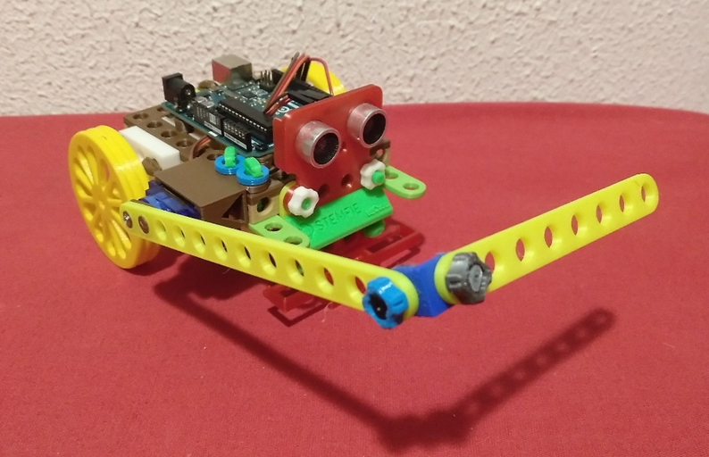

Realitzat per [Jordi Mayné](https://github.com/maynej) des de Mechatronic Study 

[mClon](https://tecnoloxia.org/mclon) es un robot educatiu dedicat a la programació, clonat del [mBot](https://www.makeblock.com) de MakerBlock. 

STEMFIE es un projecte de construcció lliure, que s'imprimeix en 3D (http://stemfie.org) 

[Electronics Suports amb compatibilitat Stemfie](https://github.com/maynej/Electronics-Stemfie), pretén facilitar l'automatització de les construccions amb targes Arduino, Microbit, ESP... 

Tota la [documentació es pot trobar en PDF](https://github.com/maynej/mClon-Stemfie/tree/main/DOC).

STL per imprimir [aquí](https://github.com/maynej/mClon-Stemfie/tree/main/STL_mClonSTEMFIE).

## Suports 3D
  
Descripció         | Imatge          | Arxiu         
------------- | ------------- | ------------- 
Base Arduino UNO |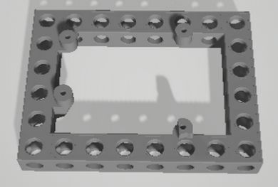 | [Base Arduino UNO](STL_mClonSTEMFIE/ArduinoUNOBase_mClonSTEMFIE.stl)
Bateria 18650 |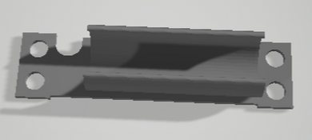 | [18650](STL_mClonSTEMFIE/18650Holder_mClonSTEMFIE.stl)
Sensor Ultra-Sons |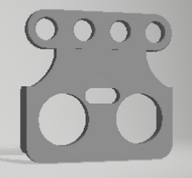 | [Simetric](STL_mClonSTEMFIE/USSymmetricSensor4V_mClonSTEMFIE.stl) , [Asimetric](STL_mClonSTEMFIE/USAsymmetricSensor4V_mClonSTEMFIE.stl)
Suport MotorDC TT |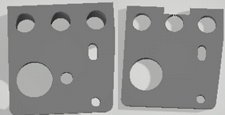 | [MotorDC TT L1](STL_mClonSTEMFIE/MotorDCTT_L1_mClonSTEMFIE.stl), [MotorDC TT L2](STL_mClonSTEMFIE/MotorDCTT_L2_mClonSTEMFIE.stl), [MotorDC TT R1](STL_mClonSTEMFIE/MotorDCTT_R1_mClonSTEMFIE.stl), [MotorDC TT R2](STL_mClonSTEMFIE/MotorDCTT_R2_mClonSTEMFIE.stl) 
Sensor Línia Sensor |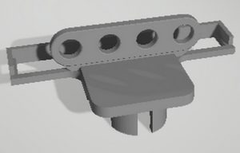 | [Sensor Línia](STL_mClonSTEMFIE/LineSensor_mClonSTEMFIE.stl)
Roda |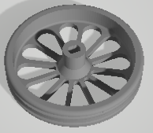 | [Roda](STL_mClonSTEMFIE/Roda_petalos2.stl)
Logo mClon STEMFIE |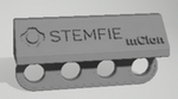 | [Logo](STL_mClonSTEMFIE/Logo4_mClonSTEMFIE.stl)
Cargol BU02.00 |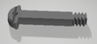 | [BU02.00](STL_mClonSTEMFIE/ShoulderScrewRHDRHBU02.00-SPN-SSC-0048.stl)
Cargol BU01.75 |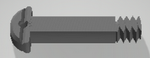 | [BU01.75](STL_mClonSTEMFIE/ShoulderScrewRHDRHBU01.75-SPN-SSC-0047.stl)
Cargol BU01.50 |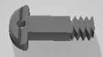 | [BU01.50](STL_mClonSTEMFIE/ShoulderScrewRHDRHBU01.50-SPN-SSC-0046.stl)
Cargol BU01.25 |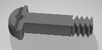 | [BU01.25](STL_mClonSTEMFIE/ShoulderScrewRHDRHBU01.25-SPN-SSC-0045.stl)
Cargol BU01.00 | | [BU01.00](STL_mClonSTEMFIE/ShoulderScrewRHDRHBU01.00-SPN-SSC-0044.stl)
Cargol BU00.75 |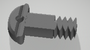 | [BU00.75](STL_mClonSTEMFIE/ShoulderScrewRHD_RH_BU00.75-SPN-SSC-0043.stl)
Cargol BU00.50 |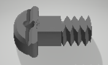 | [BU00.50](STL_mClonSTEMFIE/ShoulderScrewRHD_RH_BU00.50-SPN-SSC-0042.stl)
Femella |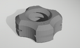 | [Femella](STL_mClonSTEMFIE/NutRHBU01.00x5mm-SPN-NUT-0001.stl)
Volandera |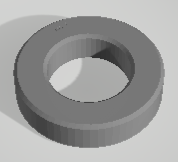 | [Volandera](STL_mClonSTEMFIE/NutRHBU01.00x5mm-SPN-NUT-0001.stl)
Bloc 4 |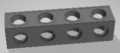 | [Bloc 4](STL_mClonSTEMFIE/beam1x1x4.stl)
Tensor 3 |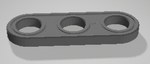 | [Tensor 3](STL_mClonSTEMFIE/BraceSTRERRBU03x01x00.25-SPN-BRC-0002.stl)

# Opcionals 
Descripció         | Imatge          | Arxiu
------------- | ------------- | ------------- 
Servomotor SG09 |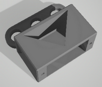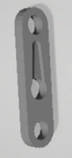 | [Servo](STL_mClonSTEMFIE/Servo3H_mClonSTEMFIE.stl) , [Adaptador SG9](STL_mClonSTEMFIE/Servo9GAdapter_Stemfie.stl)
Suport Sensor Llum LDR (Light Sensor) |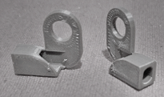 | [LDR L](STL_mClonSTEMFIE/LDRSensorL_mClonSTEMFIE.stl) , [LDR R](STL_mClonSTEMFIE/LDRSensorR_mClonSTEMFIE.stl)
Escaire | | [Escaire](STL_mClonSTEMFIE/1L.stl)
Tensor 4 | | [Tensor 4](STL_mClonSTEMFIE/BraceSTRERRBU04x01x00.25-SPN-BRC-0003.stl)

## Llicència

Attribution-ShareAlike 4.0 International (CC BY-SA 4.0)
