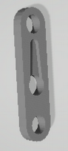

# mClon-Stemfie

mClon amb compatibilitat Stemfie

Realitzat per [Jordi Mayné](https://github.com/maynej) des de Mechatronic Study 

Stemfie es un projecte de construcció lliure, que s'imprimeix en 3D (http://stemfie.org) 

Electronics Suports (https://github.com/maynej/Electronics-Stemfie) amb compatibilitat Stemfie, pretén facilitar l'automatització de les construccions amb targes Arduino, Microbit, ESP...

Tota la [documentació es pot trobar en PDF](https://github.com/maynej/Electronics-Stemfie/tree/main/Doc).

STL per imprimir (https://github.com/maynej/mClon-Stemfie).

## Suports 3D
  
Descripció         | Imatge          | Arxiu         
------------- | ------------- | ------------- 
Arduino UNO Base | | [Arduino UNO base](ArduinoUNOBase_mClonSTEMFIE.stl)
Holder Li-ion 18650| | 
Ultra Sound Sensor || [Symmetric](STL/USSymmetricSensor4V_mClonSTEMFIE.stl), [Asymmetric] (STL/USAsymmetricSensor4V_mClonSTEMFIE.stl)
Suport Motor DC TT| |[MotorTT L1](Motors/MotorDC_TT_L1_mClonSTEMFIE.stl), [MotorTT L2](Motors/MotorDC_TT_L2_mClonSTEMFIE.stl), [MotorTT R1](Motors/MotorDC_TT_R1_mClonSTEMFIE.stl), [MotorTT R2](Motors/MotorDC_TT_R2_mClonSTEMFIE.stl) 
MotorDC TT Support | |[MotorDC TT L1] (STL/MotorDCTT_L1_mClonSTEMFIE.stl), (STL/MotorDCTT_L2_mClonSTEMFIE.stl), (STL/MotorDCTT_R1_mClonSTEMFIE.stl), (STL/MotorDCTT_R2_mClonSTEMFIE.stl) 
Line Sensor | | [Pending]
Suport palanca Servo-motor SG9| |[Adapter SG9](ServoMount/Servo9GAdapter_Stemfie.stl)
Suport Sensor Llum LDR| | [LDR L](SensorsMount/LDRSensorL_STEMFIE.stl), [LDR R](SensorsMount/LDRSensorL_STEMFIE.stl)

## Llicència

Attribution-ShareAlike 4.0 International (CC BY-SA 4.0)
